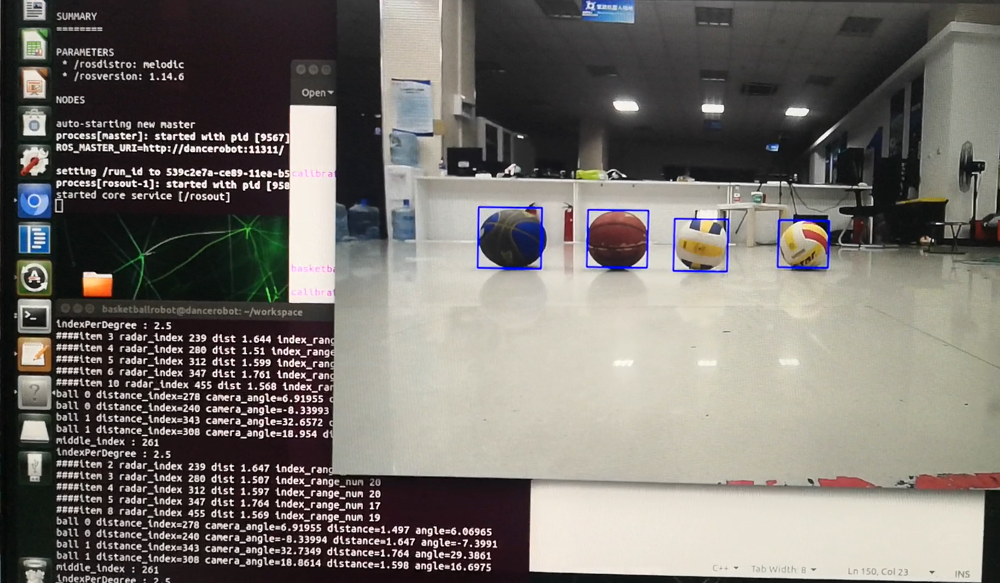
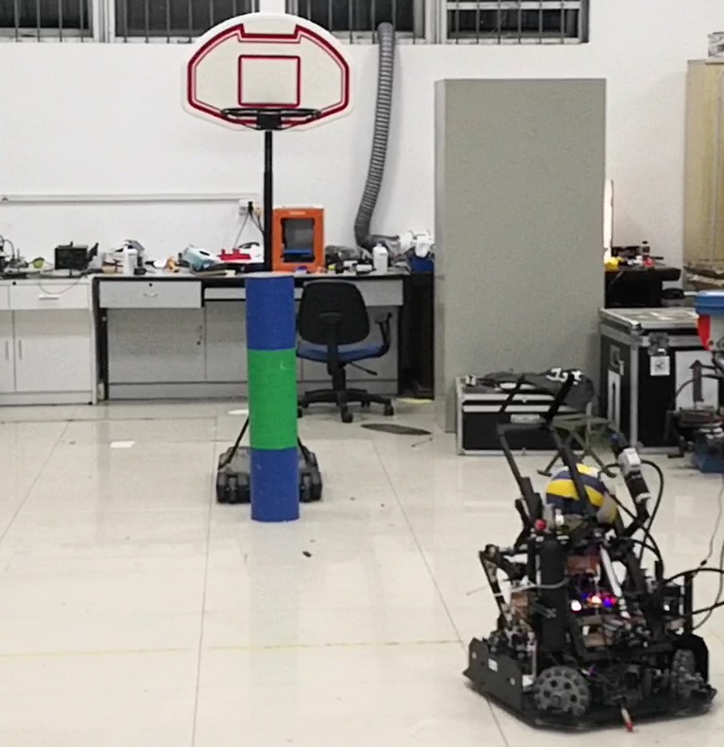

# 2020年篮球机器人视觉代码

## 1. 算法简介

### 1.1 识别检测：

+ 使用[Yolo V4](https://github.com/AlexeyAB/darknet)（C++版）在`yolov4.conv.137`权重上利用自己采集的上千张数据集进行迁移学习，训练出合适的模型。

+ 使用TensorRT[https://github.com/NVIDIA/TensorRT]库对原模型进行推理，完成Float32->Float16到转换，保存半精度计算的engine([Yolo-TensorRT仓库](https://github.com/enazoe/yolo-tensorrt))，提高机器人识别帧率。
+ 使用相机读取最新帧图像，完成检测并返回`labels`和`boundingboxes`。

### 1.2 定位

#### 1.2.1 球类定位

+ 利用图像检测得到的`boundingbox`中心和相机内参，计算球的正投影相对机器人中心投影的物理角度。
+ 使用Hokuyo雷达获取机器人到指定方向上球的距离（需要配合一些去除噪点的算法）
+ 利用角度和距离，解算出球的坐标。



#### 1.2.2 标定柱（篮筐）定位

+ 利用`HSV`参数条件组合识别蓝绿蓝的标定柱
+ 利用深度学习学习识别颜色特征明显的标定柱



## 2. 依赖

### 2.1 硬件环境

+ Nvidia Jetson Xavier NX

### 2.2 软件环境

+ ROS
+ Ubuntu18
+ Opencv4.1.0

+ Usbcapture相机驱动（intel x86下可用，Xavier暂不可用）

## 3. 使用方法

#### 3.1 编译

```
mkdir build & cd build
cmake ../
make 
```

#### 34.2 运行

```
# 赋予雷达端口权限
sudo chmod a+rw /dev/ttyACM0
# 启动Roscore
roscore
# 设置雷达参数
rosparam set hokuyo_node/calibrate_time false
rosparam set hokuyo_node/port /dev/ttyACM0
# 测试运行（如果和其他控制代码一起编译，可以通过rosrun运行）
./build/vision/main
```

